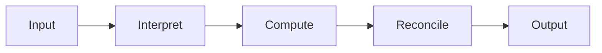
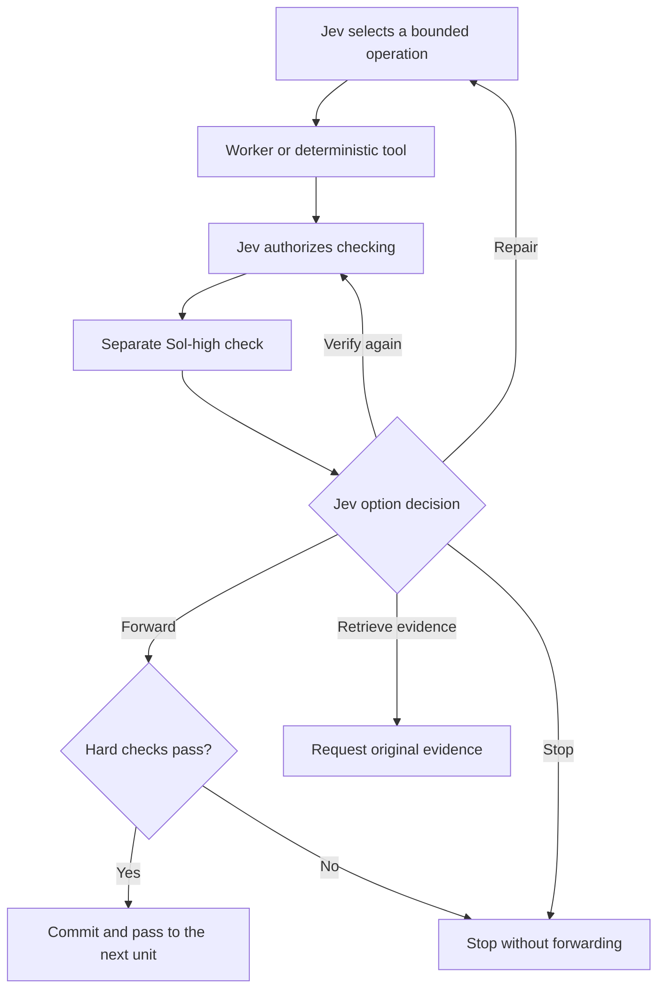

# Jev-Orchestrated Decision Mesh

**Caber Interstitial Decision Mesh (CIDM)**

**Training-free AI orchestration · Five-unit checked reference implementation**

**Main contributor and project creator: [Kenneth Vic A. Caber](https://github.com/kentilaok).**

Jev is a model from [TypeSafe AI](https://typesafe.ai/blog/introducing-system-one-models-and-jev); CIDM is an independent orchestration design built around its typed decisions.

CIDM routes data and bounded reasoning tasks through existing models. **Jev is the orchestrator:** it chooses the next operation, receives the result of a separate high-effort check, and decides whether to move forward, repair, retrieve evidence, verify again, or stop.

The goal is to produce useful, supported answers while reducing unnecessary context and expensive model work. The previous 12-task pilot recorded **34,942 baseline tokens versus 131,388 CIDM tokens**; it did not run this five-unit checked network. A current matched three-row GPT-6 fixture was also unfavorable to the five-unit path: **36,663 versus 431 tokens**, and **$0.012201078 versus $0.001726** in reported API charges. Both final answers passed the fixture's value, scope, and citation checks. These results motivate an initial Jev choice between a direct route and the full checked graph; they do not estimate performance on complex projects. See [benchmarks](docs/BENCHMARKS.md) and [recorded GPT-6 evidence](research/live-gpt6-fixture/README.md).

This project borrows the ideas of layered processing, connected units, and selective attention to relevant information. It performs **no training, fine-tuning, backpropagation, or learned-weight updates**. Neural networks and Transformers are architectural inspiration for data flow; this repository does not build or train a new neural model. Existing provider models perform inference in Codex or through APIs.

## How it works

The general skill first asks Jev whether deterministic computation, a bounded direct worker, the full checked network, evidence retrieval, or a stop fits the task. The included Python `network_run.py` demonstrates the **full checked network**; it does not automatically run that initial topology choice. [The typed request](examples/topology.request.json) shows the decision format.



Each of the five units uses the same checked transition:



**A Sol-high pass never forwards a result automatically.** It returns to Jev first. A failed hard check, invalid checker report, changed candidate, or missing predecessor prevents forwarding even if a model recommends it.

The controller records the exact operation, inputs, source versions, candidate and checker hashes, and approval IDs. Approvals are single-use. Unreviewed work stays out of accepted context. This controls exposed operations in the broker; it cannot intercept private thinking inside an inference call.

Read the [architecture](docs/ARCHITECTURE.md) for the data-flow explanation, [execution routes](docs/EXECUTION-ROUTES.md) for billing and authentication, and [connectors](docs/CONNECTORS.md) for extension boundaries.

## Models and APIs

| Role | Default |
|---|---|
| Orchestration | TypeSafe Jev |
| Reasoning worker | Jev selects GPT-6 Luna or Sol at low, medium, high, or xhigh effort |
| Independent review context | OpenAI GPT-6 Sol, high effort |
| General planning option | GPT-6 Sol, xhigh effort |
| Astra | Only when specifically authorized and enabled; low effort only |
| API runner transport | OpenRouter, with an explicit provider route |
| Codex-native route | Codex subagents use the active ChatGPT sign-in; Jev still needs separate API access |

The worker catalog is limited to **OpenAI GPT-6 Luna and Sol** by default. Jev chooses a worker route for each generative unit. Deterministic units do not spend worker tokens. The checker stays on Sol high. Jev is a separate TypeSafe service. The Python runner uses OpenRouter APIs for all three roles and defaults to an explicit Azure route, which worked under the validation account's zero-retention policy. When this skill runs within a Codex session signed in with ChatGPT, model-specific Codex subagents can use plan usage for Luna/Sol work, while Jev remains a separate API call. The Codex-native path is a skill-guided workflow; the Python runner does not execute that path. [OpenAI Docs authentication](https://learn.chatgpt.com/docs/auth) distinguishes plan access from API-key billing.

## Quick start

Python **3.10+** is required. The reference implementation uses the standard library only.

```bash
git clone https://github.com/kentilaok/caber-interstitial-decision-mesh.git
cd caber-interstitial-decision-mesh
python scripts/network_run.py --offline --task examples/production-records.json --out runs/offline-001
python scripts/audit_network.py runs/offline-001/result.json
python scripts/compare_baseline.py --offline --task examples/production-records.json --out runs/baseline-offline-001
```

Offline mode is an explicitly labeled deterministic simulation. The included fixture computes a production defect rate; it exercises the gate protocol, not a general autonomous application.

For a live run, set `OPENROUTER_API_KEY` securely in your environment, then use:

```bash
python scripts/network_run.py --live --config examples/config.openrouter.json --task examples/production-records.json --out runs/live-001
```

This command consumes OpenRouter API credits for Jev, workers, and checkers. Inspect the config's models, limits, and reserve prices first. Each output directory must be new so prior traces are preserved. Provider availability and account policies can prevent a run; there is no silent model fallback.

## Use as a Codex skill

The repository root is a skill: [SKILL.md](SKILL.md) contains the instructions and supporting scripts are included. Install or copy it into your Codex skills directory under `caber-interstitial-decision-mesh`, then invoke:

```text
$caber-interstitial-decision-mesh
```

Installation locations can vary by Codex setup. Keep credentials in the environment and task output in the task workspace, not in the installed skill directory.

## Test

```bash
python -m unittest discover -s tests -v
```

Tests run offline without credentials. They cover gate ordering, immutable policy, one-use permissions, rejection/repair behavior, checker isolation, explicit Jev decisions, model-specific budget reservation, configuration, and transport accounting. [Validation scope](docs/VALIDATION.md) includes the test counts and saved live evidence.

## Current scope

- Five sequential checked units and a reusable gate contract.
- A typed Jev topology choice for the general skill; the reference runner remains the strict five-unit path.
- Bounded repair and rechecking; explicit stops for missing evidence.
- Jev-selected GPT-6 Luna/Sol worker route and mandatory Sol-high checker.
- Separate decision and reasoning connector interfaces; OpenRouter is the bundled implementation.
- Local journals and provider usage accounting, including failed attempts and unknown counters.

The executable demo is a structured-record calculation. [Extension boundaries](docs/ROADMAP.md) identify the task adapters and retrieval functions outside this implementation. [Routing economics](docs/ROUTING-ECONOMICS.md) gives the full cost equation, the observed fixture comparison, and the audit of the premium-website forecast. More gates and checkers can increase tokens and latency.

## Contribute and credit

**Kenneth Vic A. Caber** is the main contributor and creator of the CIDM concept and skill project. Development used AI coding assistance. The architecture builds on existing ideas in model routing, modular computation, verification, and context management; this attribution is not a claim to have invented those broader fields.

See the [technical thesis](docs/THESIS.md), [research context](docs/RESEARCH-CONTEXT.md), [CONTRIBUTING.md](CONTRIBUTING.md), and [CITATION.cff](CITATION.cff). Code and documentation are released under the [MIT license](LICENSE).
