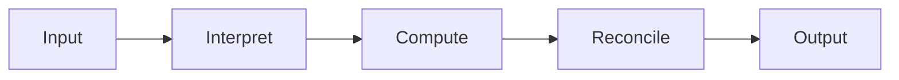
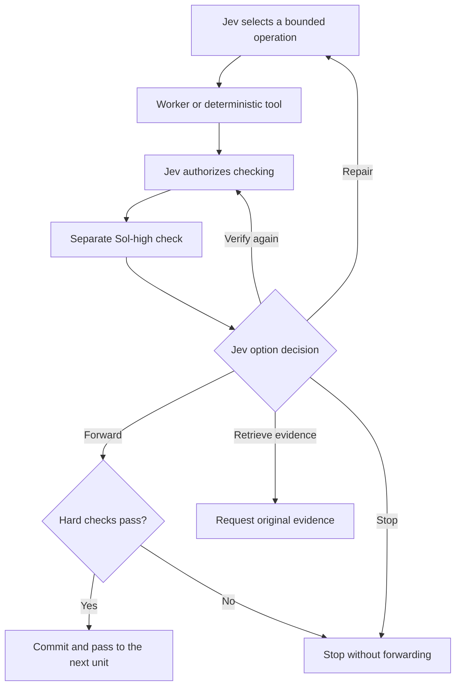

# CIDM — Caber Interstitial Decision Mesh

**Training-free AI orchestration · Work in progress**

**Main contributor and project creator: [Kenneth Vic A. Caber](https://github.com/kentilaok).**

CIDM routes data and bounded reasoning tasks through existing models. **Jev is the orchestrator:** it chooses the next operation, receives the result of a separate high-effort check, and decides whether to move forward, repair, retrieve evidence, verify again, or stop.

The goal is to produce useful, supported answers while reducing unnecessary context and expensive model work. **Token savings and general reliability are not established.** An earlier prototype reduced Sol usage but increased total tokens. See [benchmarks and limitations](docs/BENCHMARKS.md).

This project borrows the ideas of layered processing, connected units, and selective attention to relevant information. It performs **no training, fine-tuning, backpropagation, or learned-weight updates**. Neural networks and Transformers are architectural inspiration for data flow; this repository does not build or train a new neural model. Existing provider models perform inference through APIs.

## How it works



Each of the five units uses the same checked transition:



**A Sol-high pass never forwards a result automatically.** It returns to Jev first. A failed hard check, invalid checker report, changed candidate, or missing predecessor prevents forwarding even if a model recommends it.

The controller records the exact operation, inputs, source versions, candidate and checker hashes, and approval IDs. Approvals are single-use. Unreviewed work stays out of accepted context. This controls exposed operations in the broker; it cannot intercept private thinking inside an inference call.

Read the [architecture](docs/ARCHITECTURE.md) for the data-flow explanation and [connectors](docs/CONNECTORS.md) for extension boundaries.

## Models and APIs

| Role | Default |
|---|---|
| Orchestration | TypeSafe Jev |
| Reasoning worker | OpenAI GPT-5.6 Sol, medium effort |
| Independent review context | OpenAI GPT-5.6 Sol, high effort |
| Initial API transport | OpenRouter, with an explicit provider route |

The current worker and checker configuration is restricted to **OpenAI/ChatGPT-family models**. Jev is a separate TypeSafe service. Model IDs and provider settings are configurable; connectors are isolated behind explicit interfaces so other integrations can be added and tested later. The bundled runner uses APIs, not a logged-in ChatGPT browser session or subscription.

## Quick start

Python **3.10+** is required. The reference implementation uses the standard library only.

```bash
git clone https://github.com/kentilaok/caber-interstitial-decision-mesh.git
cd caber-interstitial-decision-mesh
python scripts/network_run.py --offline --task examples/production-records.json --out runs/offline-001
python scripts/audit_network.py runs/offline-001/result.json
```

Offline mode is an explicitly labeled deterministic simulation. The included fixture computes a production defect rate; it exercises the gate protocol, not a general autonomous application.

For a live run, set `OPENROUTER_API_KEY` securely in your environment, then use:

```bash
python scripts/network_run.py --live --config examples/config.openrouter.json --task examples/production-records.json --out runs/live-001
```

Live inference consumes API credits. Inspect the config's models, limits, and reserve prices first. Each output directory must be new so prior traces are preserved. Provider availability and account policies can prevent a run; there is no silent model fallback.

## Use as a Codex skill

The repository root is a skill: [SKILL.md](SKILL.md) contains the instructions and supporting scripts are included. Install or copy it into your Codex skills directory under `caber-interstitial-decision-mesh`, then invoke:

```text
$caber-interstitial-decision-mesh
```

Installation locations can vary by Codex setup. Keep credentials in the environment and task output in the task workspace, not in the installed skill directory.

## Test

```bash
python -m unittest discover -s tests -v
```

Tests run offline without credentials. They cover gate ordering, immutable policy, one-use permissions, rejection/repair behavior, checker isolation, explicit Jev decisions, configuration, and transport accounting. [Validation scope](docs/VALIDATION.md) explains what has and has not been tested.

## Current scope

- Five sequential checked units and a reusable gate contract.
- Bounded repair and rechecking; explicit stops for missing evidence.
- Configurable OpenAI worker/checker models with a mandatory high-effort checker.
- Separate decision and reasoning connector interfaces; OpenRouter is the bundled implementation.
- Local journals and provider usage accounting, including failed attempts and unknown counters.

The current demo is a structured-record calculation. Broader retrieval, arbitrary task adapters, concurrency, and controlled efficiency trials are [work in progress](docs/ROADMAP.md). More gates and checkers can increase tokens and latency; the project does not promise that every request becomes cheaper.

## Contribute and credit

**Kenneth Vic A. Caber** is the main contributor and creator of the CIDM concept and skill project. Development used AI coding assistance. The architecture builds on existing ideas in model routing, modular computation, verification, and context management; this attribution is not a claim to have invented those broader fields.

See [research context](docs/RESEARCH-CONTEXT.md), [CONTRIBUTING.md](CONTRIBUTING.md), and [CITATION.cff](CITATION.cff). Code and documentation are released under the [MIT license](LICENSE).
