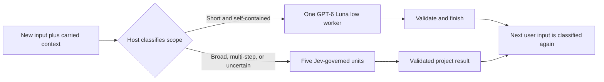
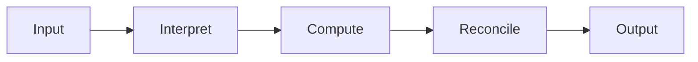
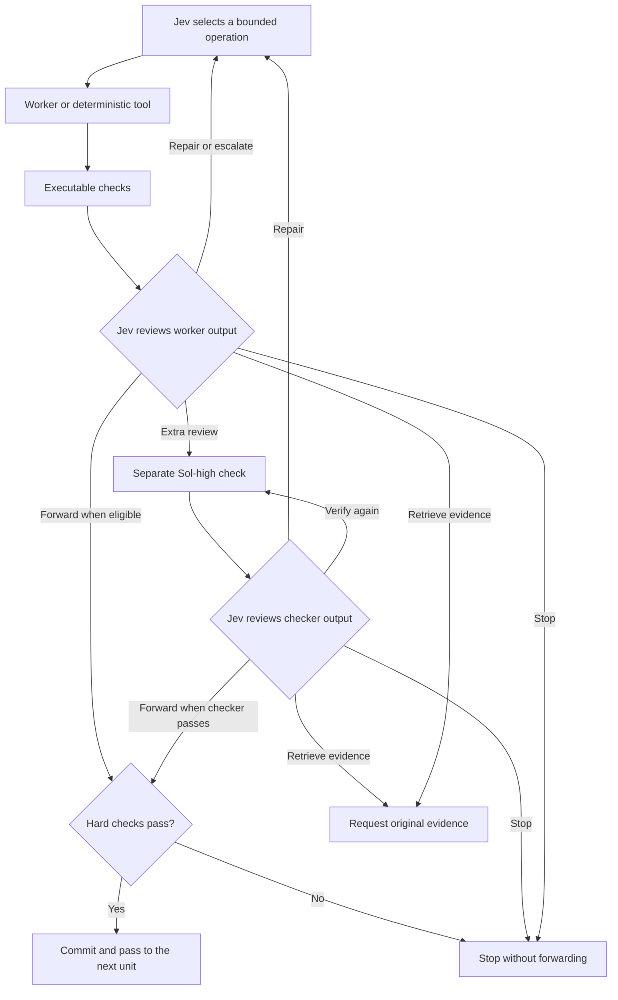

# Jev-Orchestrated Decision Mesh

**Caber Interstitial Decision Mesh (CIDM)**

**Training-free AI orchestration · Five-unit checked reference implementation**

**Main contributor and project creator: [Kenneth Vic A. Caber](https://github.com/kentilaok).**

Jev is a model from [TypeSafe AI](https://typesafe.ai/blog/introducing-system-one-models-and-jev); CIDM is an independent orchestration design built around its typed decisions.

CIDM routes data and bounded reasoning tasks through existing models. **Within the five-unit network, Jev is the orchestrator:** it chooses the next operation and receives every completed unit output. It can finish, repair, escalate, retrieve evidence, or request a separate high-effort check when warranted. Any completed check returns to Jev. The one-worker short path ends after Luna-low output passes task-specific validation; it does not claim Jev review.

CIDM is intended for broader projects that need multiple stages, evidence, delegation, or review. Simple standalone yes/no questions and routine one-step tasks do not invoke the skill. When invoked, the host first classifies **each new input with its carried project context**. Broad, multi-step, or uncertain work enters the five-unit Jev network by default. Only a self-contained request that needs one bounded response uses a single **GPT-6 Luna low** worker and then finishes after task-specific validation. A brief follow-up to an active project is classified with that project's context. Sol-high review inside the five-unit graph is optional.

The former mandatory-check path used **36,663 tokens and $0.012201078** on a three-row GPT-6 fixture. After removing the checker prerequisite and strengthening final-text validation, a five-unit run completed with **zero Sol-high calls, 25,510 tokens, and $0.006413654**. An earlier conditional run with different Jev worker choices cost $0.00312019. A one-call Sol-high baseline used **431 tokens and $0.001726**. All final values and source checks passed. These individual runs on an intentionally small demonstration do not estimate project-level efficiency. See [the current recorded run](research/live-gpt6-optional-final/README.md), [the first conditional run](research/live-gpt6-optional-fixture/README.md), [the earlier mandatory run](research/live-gpt6-fixture/README.md), and [benchmark boundaries](docs/BENCHMARKS.md).

Under the earlier routing policy, the [compact Jev fast exit](research/live-gpt6-fast-exit/README.md) chose exact code in **one Jev call, 716 tokens, and $0.000026964**, with no worker or checker call. An earlier wording took 889 tokens for the same choice. These traces document a previous policy on an easy fixture. They do not measure the new Luna-low short path or project-level routing.

This project borrows the ideas of layered processing, connected units, and selective attention to relevant information. It performs **no training, fine-tuning, backpropagation, or learned-weight updates**. Neural networks and Transformers are architectural inspiration for data flow; this repository does not build or train a new neural model. Existing provider models perform inference in Codex or through APIs.

## How it works

For each new CIDM input, classify the request **together with accepted project context** before dispatch. This classification is a host/controller assertion, not a Jev decision or a trained classifier. If the combined work needs multiple stages, or its scope is uncertain, the default is five units. Jev then chooses bounded operations and reviews every completed unit result. Only a short, self-contained request takes one Luna-low worker pass, validation, and finish. A later input goes through classification again. The Python `scripts/adaptive_run.py` is a bounded structured-record example, not a classifier for arbitrary Codex messages. In interactive Codex, this is a skill-guided procedure rather than an installed transition broker. `scripts/network_run.py` runs the five-unit branch directly.





Each of the five units uses this decision path:



**Within the five-unit network, a worker result always returns to Jev before the broker forwards it.** Sol High is optional; when called, its result also returns to Jev. The short Luna-low branch uses its own hard validator and finishes without a Jev pass. A failed hard check, invalid requested checker report, changed candidate, or missing predecessor prevents forwarding even if a model recommends it.

The controller records the exact operation, inputs, source versions, candidate hash, optional checker hash, and approval IDs. Approvals are single-use. Unreviewed work stays out of accepted context. This controls exposed operations in the broker; it cannot intercept private thinking inside an inference call.

Read the [architecture](docs/ARCHITECTURE.md) for the data-flow explanation, [execution routes](docs/EXECUTION-ROUTES.md) for billing and authentication, and [connectors](docs/CONNECTORS.md) for extension boundaries.

## Models and APIs

| Role | Default |
|---|---|
| Orchestration | TypeSafe Jev |
| Reasoning worker in the five-unit graph | Jev selects GPT-6 Luna or Sol at low, medium, high, or xhigh effort |
| Short self-contained route | One GPT-6 Luna-low worker, then task-specific validation |
| Optional independent review context | OpenAI GPT-6 Sol, high effort |
| General planning option | GPT-6 Sol, xhigh effort |
| Astra | Only when specifically authorized and enabled; low effort only |
| API runner transport | OpenRouter, with an explicit provider route |
| Codex-native route | Codex subagents use the active ChatGPT sign-in; Jev still needs separate API access |

The worker catalog is limited to **OpenAI GPT-6 Luna and Sol** by default. Jev chooses a worker route for each generative five-unit operation. Deterministic units do not spend worker tokens. If requested, the checker uses Sol high. Jev is a separate TypeSafe service. The Python runner uses OpenRouter APIs for model calls and defaults to an explicit Azure route, which worked under the validation account's zero-retention policy. When this skill runs within a Codex session signed in with ChatGPT, model-specific Codex subagents can use plan usage for Luna/Sol work, while Jev remains a separate API call. The Codex-native path is a skill-guided workflow; the Python runner does not execute that path. [OpenAI Docs authentication](https://learn.chatgpt.com/docs/auth) distinguishes plan access from API-key billing.

## Quick start

Python **3.10+** is required. The reference implementation uses the standard library only.

```bash
git clone https://github.com/kentilaok/Jev-Orchestrated-Decision-Mesh.git
cd Jev-Orchestrated-Decision-Mesh
python scripts/network_run.py --offline --task examples/production-records.json --out runs/offline-001
python scripts/audit_network.py runs/offline-001/result.json
python scripts/adaptive_run.py --offline --task examples/production-records.json --out runs/broad-offline-001
python scripts/compare_baseline.py --offline --task examples/production-records.json --out runs/baseline-offline-001
```

Offline mode is an explicitly labeled deterministic simulation. The included fixture computes a production defect rate; it exercises the gate protocol, not a general autonomous application.

For a live run, set `OPENROUTER_API_KEY` securely in your environment, then use:

```bash
python scripts/adaptive_run.py --live --config examples/config.openrouter.json --task examples/production-records.json --out runs/broad-live-001
```

With no `--classification` file, this command conservatively takes the broad five-unit route. The [execution guide](docs/EXECUTION-ROUTES.md#scope-classification-before-an-api-run) shows how the host can supply a task-and-context-bound assertion for the short Luna-low fixture. The command consumes OpenRouter API credits for calls it actually makes. Inspect the config's models, limits, and reserve prices first. Each output directory must be new so prior traces are preserved. Provider availability and account policies can prevent a run; there is no silent model fallback.

## Use as a Codex skill

The repository root is a skill: [SKILL.md](SKILL.md) contains the instructions and supporting scripts are included. Install or copy it into your Codex skills directory under `caber-interstitial-decision-mesh`, then invoke:

```text
$caber-interstitial-decision-mesh
```

Installation locations can vary by Codex setup. Keep credentials in the environment and task output in the task workspace, not in the installed skill directory.

## Test

```bash
python -m unittest discover -s tests -v
```

Tests run offline without credentials. They cover gate ordering, immutable policy, one-use permissions, rejection/repair behavior, checker isolation, explicit Jev decisions, model-specific budget reservation, configuration, and transport accounting. [Validation scope](docs/VALIDATION.md) includes the test counts and saved live evidence.

## Current scope

- Five sequential checked units and a reusable gate contract.
- A bounded structured-record example for the entry choice, plus a separate five-unit runner; arbitrary Codex project-message classification remains a skill-guided host decision.
- Bounded repair and rechecking; explicit stops for missing evidence.
- Jev-selected GPT-6 Luna/Sol worker route, Jev after every unit output, and conditional Sol-high review.
- Separate decision and reasoning connector interfaces; OpenRouter is the bundled implementation.
- Local journals and provider usage accounting, including failed attempts and unknown counters.
- Jev-token, worker-token, orchestration-ratio, call-cap, and matched-baseline cost metrics with unknown values kept explicit.

The executable demo is a structured-record calculation. [Extension boundaries](docs/ROADMAP.md) identify task adapters and retrieval outside this implementation. [Routing economics](docs/ROUTING-ECONOMICS.md) and [orchestration budgets](docs/ORCHESTRATION-BUDGETS.md) separate measured results, budget controls, and the premium-website forecast. More gates and checkers can increase tokens and latency.

## Contribute and credit

**Kenneth Vic A. Caber** is the main contributor and creator of the CIDM concept and skill project. Development used AI coding assistance. The architecture builds on existing ideas in model routing, modular computation, verification, and context management; this attribution is not a claim to have invented those broader fields.

See the [technical thesis](docs/THESIS.md), [research context](docs/RESEARCH-CONTEXT.md), [CONTRIBUTING.md](CONTRIBUTING.md), and [CITATION.cff](CITATION.cff). Code and documentation are released under the [MIT license](LICENSE).
