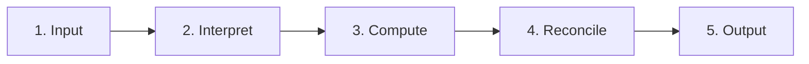
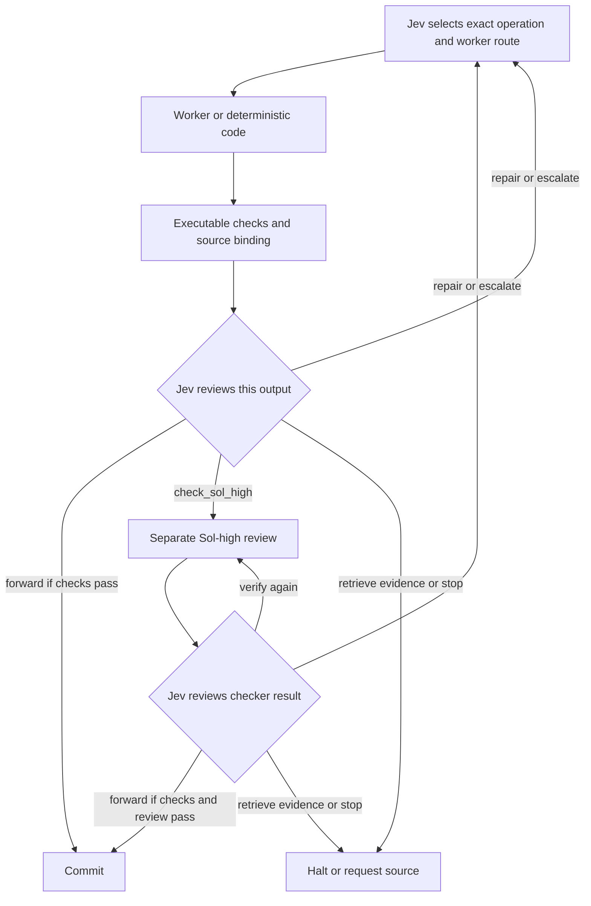

# Architecture

**Main contributor and architecture proposer: Kenneth Vic A. Caber.**

Caber Interstitial Decision Mesh (CIDM) is training-free orchestration around existing model APIs and deterministic tools. The five-unit reference network uses Jev decisions before bounded work and after **every** completed unit output. Jev may request a separate Sol-high review when the deterministic checks leave material uncertainty; Sol High is not a prerequisite for forwarding. CIDM does not train a model, load learned routing checkpoints, or modify the internal weights of external models.

The [fused gate variant](GATE-FUSION.md) preserves the five-unit order and post-result Jev review while combining a result's acceptance with authorization of the next exact route in one decision. Its deferred one-use permit must bind the expected post-commit state. Controllers and saved traces that use separate before/after decisions remain a distinct protocol; fewer calls alone do not establish lower total cost or equivalent quality.

CIDM is invoked for broad projects with real decomposition, evidence, or review needs. Simple standalone yes/no questions and one-step tasks are handled without this skill. On every new input to an invoked CIDM workflow, the host/controller classifies the input **with accepted project context**, recording that context and the reason for the choice. Broad, multi-step, or uncertain scope enters the five-unit network by default. Jev decides the bounded action at each unit and reviews every completed unit output. A request that is self-contained and needs only one bounded response takes one GPT-6 Luna-low worker pass and task-specific validation, then finishes with no Jev or Sol-high follow-up. A short message referring to an ongoing broad project retains that broader context. Every new user input is classified again.

An exact parser, calculation, hash, test run, or prewritten transformation can be a deterministic unit. When a primary agent interprets evidence, designs code, chooses a repair, or writes an implementation, model inference is doing substantive work even if it later runs deterministic tools. That work belongs in the worker/primary-model ledger. A zero delegated-worker count does not show zero model tokens or a cheap total task.

The [topology request](../examples/topology.request.json) and `scripts/adaptive_run.py` provide a bounded production-record demonstration. The runner receives a host classification assertion bound to the task and context; it does not verify that judgment. The separate `scripts/native_transition_broker.py` accepts project text and controls bounded Codex CLI subprocesses. Its caller supplies the goal, accepted context, sources, and any short-route assertion. Missing or uncertain classification defaults to broad. A valid input binding prevents stale assertions, while semantic scope remains the caller's responsibility. The interactive Codex route is still an instruction-level workflow: the standalone broker cannot intercept an ordinary primary agent. `scripts/network_run.py` executes the five-unit API branch directly. The saved [small-task GPT-6 measurements](ROUTING-ECONOMICS.md#measured-gpt-6-fixture-comparison) include a compact Jev fast exit from the **previous** topology policy, so they do not evaluate this new short-path rule.

## Five sequential units

The reference topology has one input unit, three processing units, and one output unit. “Hidden” is a diagram label for an intermediate unit, not a neural hidden layer.

Each unit has the same transaction:

The broker omits `forward` when hard checks fail and omits it after a requested checker fails. A checker pass never forwards automatically. Every completed checker return, including a malformed one, reaches Jev as a bounded envelope before another action.

## Reusable unit transaction

`Jev authorizes computation → bounded result → executable checks → Jev chooses forward, repair, escalate, optional Sol-high review, retrieve evidence, or stop → broker eligibility → commit or continue`

- `forward` requires passing executable checks, the matching Jev decision, and expected predecessors. If Jev requested Sol High, it also requires that exact review to be valid and passing.
- `repair` creates a new candidate requiring a new worker-output Jev decision; `escalate` restricts the next worker selection to a higher resource route. Neither action automatically accepts the current candidate.
- `retrieve_evidence` cannot invent missing sources. The bounded reference runner stops for additional evidence; an application may supply an explicit retrieval adapter.
- `verify_again` is offered only after a requested Sol-high check and requests one more isolated check within the retry budget. It does not erase earlier reports.
- `stop` leaves the candidate uncommitted. Malformed checker returns still reach Jev as invalid envelopes and cannot be forwarded.

The checker itself is not recursively checked by another Sol-high call. Its output returns to Jev, keeping the procedure finite.

## Evidence, permissions, and state

The broker binds execution and commit permissions to the unit, attempt, exact operation, original source versions, predecessor hashes, candidate hash, optional checker-report hash, and policy version. Permissions are single-use. Missing predecessors, stale state, altered artifacts, failed checks, and exhausted budgets block progress. Provisional results remain separate from accepted memory.

Original evidence remains retrievable. Selected context and summaries can omit information, so a summary is not a replacement for its sources. Each application supplies its own acceptance criteria and executable checks where possible.

When requested, the checker receives the unit objective, original evidence, candidate, relevant parent artifacts, and executable check results. Producer self-scores, confidence estimates, prior checker opinions, and Jev recommendations are excluded. Context separation reduces anchoring; it does not make errors from related models statistically independent.

## Standalone Codex CLI control boundary

The Codex CLI transition broker implements the same five-unit commit rule for project text using one bounded `codex exec --json --output-schema` subprocess per selected worker or checker. It launches children in read-only mode, validates each returned artifact's structure, source references, and predecessor links, and asks Jev to choose the next eligible transition. The broker keeps provisional output out of accepted context until the matching Jev decision and hard checks permit commit. An explicit short classification bound to the current goal, source map, and carried context takes one Luna-low child call with structural and source checks, then ends; missing or uncertain classification takes five units. These generic checks do not prove that the answer solves the project.

This control boundary includes only the broker's own subprocesses and ledger. A primary agent operating interactively outside the broker can make its own decisions. The broker also cannot inspect internal model reasoning within a child call. It records the model and effort requested of Codex, reported usage, and any model identity exposed by Codex. Actual served identity and usage remain unknown where the event stream does not provide them. The new broker changes the control mechanism, not the evidence for quality or token savings; its offline tests are not a live project benchmark.

## Models and adapters

Jev selects a generative worker from **GPT-6 Luna or GPT-6 Sol**, each at `low`, `medium`, `high`, or `xhigh` effort. Simple normalization and exact arithmetic use deterministic code. When requested, the separate checker is **GPT-6 Sol high**. GPT-6 Sol `xhigh` is available for demanding general planning. **Jev is a separate TypeSafe service** for typed decisions. Jev does not generate plans, summaries, or arbitrary answers. Astra is absent by default; explicit user authorization plus a configuration flag permits Astra low only. The reference catalog excludes the image's Luna `none`, Opus, and unrestricted Astra branches under the user's existing model policy. Exact provider model IDs and supported settings must be verified and recorded; silent substitution is prohibited.

Producer, checker, Jev-decision, and deterministic-validator callbacks separate application logic from API transport. Source retrieval remains an application extension. Additional APIs or connectors require explicit adapters and validation. Availability of an interface does not mean every provider or connector is already supported.

## Neural inspiration, without training

The design borrows the ideas of modular nodes, selective context, and connections carrying evidence. An operator-defined policy controls allowed operations, thresholds, and budgets. Any configured routing scores or weights are explicit policy settings, not learned neural parameters. The policy is versioned and fixed during a run.

These similarities do not make the API graph a Transformer, a differentiable network, or a trained reasoning model. No training, backpropagation, learned router, checkpoint activation, or neural advisor belongs to the published execution path.

The brokers control their own observable calls and commits. They cannot intercept hidden model reasoning or sandbox arbitrary host callbacks. Hard service failures, unknown billing, or invalid state can halt a run before a Jev decision completes; they never authorize forwarding. The production-record example is a small calculation, and the Codex CLI broker processes project text through controlled child calls; neither establishes a general autonomous solver. Reliability and efficiency require separate evaluation; see [BENCHMARKS.md](BENCHMARKS.md).
