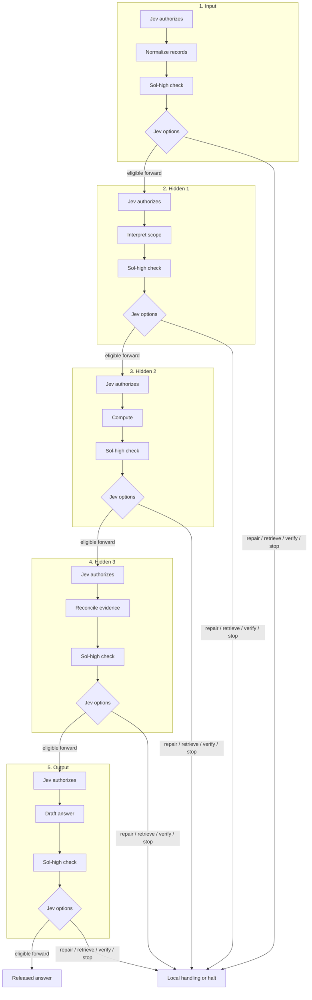

# Architecture

**Main contributor and architecture proposer: Kenneth Vic A. Caber.**

Caber Interstitial Decision Mesh (CIDM) is training-free orchestration around existing model APIs and deterministic tools. The five-unit reference network uses Jev decisions, bounded computations, and a separate Sol-high checker. It does not train a model, load learned routing checkpoints, or modify the internal weights of external models.

For a general CIDM request, Jev first chooses a [topology](../examples/topology.request.json): deterministic code, one bounded worker, the full checked five-unit network, evidence retrieval, or stop. That decision is skill-guided; `scripts/network_run.py` implements the checked branch. The one-pair [GPT-6 measurement](ROUTING-ECONOMICS.md#measured-gpt-6-fixture-comparison) motivates this split: five mandatory checker calls were wasteful on a small exact-arithmetic task. The checked network remains the required route when the user specifically invokes the five-unit checked architecture.

## Five sequential units

The reference topology has one input unit, three processing units, and one output unit. “Hidden” is a diagram label for an intermediate unit, not a neural hidden layer.

Every options node offers `forward`, `repair`, `retrieve_evidence`, `verify_again`, and `stop`. **A checker pass never forwards automatically.** The diagram omits a second Jev authorization immediately before each checker call for readability.

## Reusable unit transaction

`Jev authorizes computation → bounded result → Jev authorizes checking → Sol high returns → Jev selects an option → hard eligibility checks → commit`

- `forward` requires passing executable checks, a valid passing checker report, the matching Jev decision, and the expected predecessors.
- `repair` creates a new candidate. That candidate needs a fresh checker call and Jev decision.
- `retrieve_evidence` cannot invent missing sources. The bounded reference runner stops for additional evidence; an application may supply an explicit retrieval adapter.
- `verify_again` requests another isolated check within the retry budget. It does not erase earlier reports.
- `stop` leaves the candidate uncommitted. Malformed checker returns still reach Jev as invalid envelopes and cannot be forwarded.

The checker itself is not recursively checked by another Sol-high call. Its output returns to Jev, keeping the procedure finite.

## Evidence, permissions, and state

The broker binds execution and commit permissions to the unit, attempt, exact operation, original source versions, predecessor hashes, candidate hash, checker-report hash, and policy version. Permissions are single-use. Missing predecessors, stale state, altered artifacts, failed checks, and exhausted budgets block progress. Provisional results remain separate from accepted memory.

Original evidence remains retrievable. Selected context and summaries can omit information, so a summary is not a replacement for its sources. Each application supplies its own acceptance criteria and executable checks where possible.

The checker receives the unit objective, original evidence, candidate, relevant parent artifacts, and public check results. Producer self-scores, confidence estimates, prior checker opinions, and Jev recommendations are excluded. Context separation reduces anchoring; it does not make errors from related models statistically independent.

## Models and adapters

Jev selects a generative worker from **GPT-6 Luna or GPT-6 Sol**, each at `low`, `medium`, `high`, or `xhigh` effort. Simple normalization and exact arithmetic use deterministic code. The separate checker remains **GPT-6 Sol high**. GPT-6 Sol `xhigh` is available for demanding general planning. **Jev is a separate TypeSafe service** for typed decisions. Jev does not generate plans, summaries, or arbitrary answers. Astra is absent by default; explicit user authorization plus a configuration flag permits Astra low only. Exact provider model IDs and supported settings must be verified and recorded; silent substitution is prohibited.

Producer, checker, Jev-decision, and deterministic-validator callbacks separate application logic from API transport. Source retrieval remains an application extension. Additional APIs or connectors require explicit adapters and validation. Availability of an interface does not mean every provider or connector is already supported.

## Neural inspiration, without training

The design borrows the ideas of modular nodes, selective context, and connections carrying evidence. An operator-defined policy controls allowed operations, thresholds, and budgets. Any configured routing scores or weights are explicit policy settings, not learned neural parameters. The policy is versioned and fixed during a run.

These similarities do not make the API graph a Transformer, a differentiable network, or a trained reasoning model. No training, backpropagation, learned router, checkpoint activation, or neural advisor belongs to the published execution path.

The broker controls observable calls and commits. It cannot intercept hidden model reasoning or sandbox arbitrary host callbacks. Hard service failures, unknown billing, or invalid state can halt a run before a Jev decision completes; they never authorize forwarding. The reference task is a small production-record calculation, not a general autonomous solver. Reliability and efficiency require separate evaluation; see [BENCHMARKS.md](BENCHMARKS.md).
