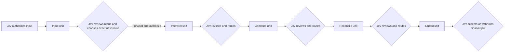

# Fused Jev transitions

CIDM keeps five logical units for broad work: **input → interpret → compute → reconcile → output**. The fused protocol changes the number of *decision calls*, not the required unit order or the rule that every completed unit result returns to Jev.

A normal five-unit path therefore needs **one initial decision and one decision after each completed unit**, or six Jev calls. A repair, missing-evidence stop, or optional checker adds decisions. This is a structural count, not a measured token, cost, latency, or quality improvement: the combined decisions may need larger prompts or choose different work.

The post-result choice is one typed, atomic choice, such as `forward_and_authorize_next:luna_low`, `repair_with_route:sol_medium`, `check_sol_high`, `retrieve_evidence`, or `stop`. A broker must not treat an independent `forward` answer and an unrelated `next_route` answer as one coherent approval. The chosen action binds the candidate hash, hard-check result, original source versions, accepted predecessors, policy version, and exact next action. A deferred permit is single-use and valid only for the expected state *after* the approved commit. Failed hard checks remove every forward option. A checker result returns to Jev before any commit. The final output needs an explicit post-output Jev acceptance; a partial project may stop before all five units.

An exact calculation, parser, hash, or test run on frozen inputs can execute within an approved unit without another Jev call. Interpreting evidence, designing or writing code, and deciding a repair are model work even if a primary agent later runs deterministic tools. Count that model work and its unknown usage separately; do not claim that zero delegated workers means zero model tokens. A selected **Sol-high worker** is also distinct from an optional **Sol-high checker**.

Keep Jev's state capsule sufficient for the next decision: objective, hard constraints, current candidate and checks, accepted predecessor summaries, material source excerpts, unresolved issues, allowed actions, and a receipt-derived budget. Hashes bind canonical state but do not convey omitted facts. Reduce context only when a trusted retrieval path can restore the evidence Jev needs. Recompute remaining calls, tokens, and API spend from provider receipts before each decision. Cached input and reasoning output are subsets of their respective totals and must not be counted twice. Unknown usage remains unknown.

The [fused reference controller](../scripts/fused_checked_network.py) and [its trace auditor](../scripts/audit_fused_network.py) are offline-tested. The standalone [Codex CLI broker](../scripts/native_transition_broker.py) offers this path only with `--gate-policy fused`; its default remains the prior `legacy` protocol. Existing historical traces and the [v3 controller](../scripts/checked_network.py) retain their original meaning. A live efficiency claim requires paired runs with the same frozen task, evidence, acceptance checks, model availability, and quality rubric. Record Jev, worker, checker, and primary-agent tokens, provider charges or Codex credits, failed calls, full wall time, and released-answer quality for each arm.
