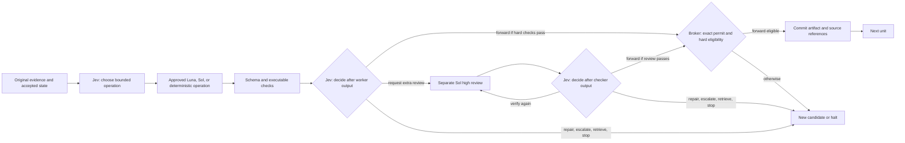

# Jev-Orchestrated Decision Mesh

**Caber Interstitial Decision Mesh (CIDM): a Jev-mediated, training-free decision graph with conditional review**

**Architecture and research thesis, 23 September 2026**
**Creator and main contributor:** Kenneth Vic A. Caber

## Abstract

For broad, multi-step, or uncertain inputs, Caber Interstitial Decision Mesh (CIDM) uses a training-free software controller around existing inference services. It uses TypeSafe Jev to choose typed actions before bounded work and **after every completed five-unit output**. Jev can forward a candidate that passes executable checks, request repair or evidence, escalate its worker route, or invoke a separate GPT-6 Sol-high checker when extra review is warranted. A requested checker result also returns to Jev before any commit. A deterministic broker alone decides whether an artifact becomes accepted context. The five-unit reference path is `input → interpret → compute → reconcile → output`. A short, self-contained input can instead use one GPT-6 Luna-low worker with task-specific validation and no Jev call. GPT-6 Luna and Sol at low through xhigh effort are the five-unit worker catalog; Astra is excluded unless the user specifically authorizes and configures it.

The research question is whether this interstitial control improves *qualified answer yield per unit of total resources* on a defined project distribution. On one intentionally small GPT-6 fixture, the former mandatory-check path used 36,663 tokens and $0.012201078. Two conditional-review runs skipped Sol High: the first used 25,651 tokens and $0.00312019; the later used 25,510 tokens and $0.006413654. Under the previous admission policy, a compact Jev fast gate chose exact code in one call, 716 tokens, and $0.000026964. A correct one-call Sol-high baseline used 431 tokens and $0.001726. These observations justify excluding trivial standalone tasks from CIDM invocation and controlling orchestration overhead within larger projects. They do not measure the revised context-aware entry or Luna-low short branch. Different prompts and Jev worker choices affect costs; none of these observations estimates project-level benefit. A historical 12-task pilot also found fewer Sol tokens but **more total tokens**. This document specifies the control contract and a falsifiable evaluation.

## Position relative to prior work

[FrugalGPT](https://arxiv.org/abs/2305.05176) studies cost-aware LLM cascades, and [RouteLLM](https://arxiv.org/abs/2406.18665) trains routers from preference data. CIDM tests a fixed, auditable broker with a typed Jev decision before a bounded operation, after every completed worker output, and after every requested checker return. Jev's vendor describes it as mapping unstructured state to typed probabilistic decisions; that interface suits predefined actions, but vendor evaluations of Jev do not measure CIDM end to end. [TypeSafe's Jev announcement](https://typesafe.ai/blog/introducing-system-one-models-and-jev) describes those capabilities and its own evaluation caveats.

The five software units and selective context borrow vocabulary from neural networks and [Transformers](https://arxiv.org/abs/1706.03762). CIDM is not a neural layer, self-attention mechanism, differentiable graph, or trained router. Its policy, limits, permitted models, and hashes are operator-defined and remain fixed for a run. No first-invention claim is made for routing, verification, or model cascades; Kenneth Vic A. Caber's attribution covers this named combination and implementation.

## Applicability and topology admission

CIDM is for broad projects with meaningful stages, evidence, delegation, or review needs. Simple standalone yes/no questions and routine one-step tasks are handled directly without invoking this skill. After CIDM is invoked, a host/controller first classifies **every fresh user input with its accepted project context**. The classification is an auditable host assertion, not a Jev decision or a learned task classifier. Broad, multi-step, uncertain, or unclassified scope defaults to the five-unit network. Jev's entry options there are five units, retrieve evidence, or stop; its per-unit decisions select exact operations and worker routes. Only an explicitly short, self-contained input uses one GPT-6 Luna-low worker, task-specific validation, and finish, with no Jev or checker call. A brief follow-up in a continuing broad project does not qualify merely because its message is short. Classify the next input again with carried context. [The example contract](../examples/topology.request.json) and `scripts/adaptive_run.py` cover a bounded structured-record fixture; the interactive Codex route is an instruction-level procedure, not an enforced host-native transition broker.

Under the **previous** admission policy, Jev chose among exact code, direct Luna low, direct Sol high, five units, evidence, and stop. Its compact wording used 716 provider tokens and $0.000026964 in one saved run; an earlier, longer wording used 889 tokens and $0.00003423. Both chose exact code and no worker. These traces do not evaluate the new Luna-low short path or context-aware classification. The small one-call Sol baseline had no Jev gate; the five-unit runs did not include the previous admission call. A proper routing experiment must count classification overhead, any Jev entry choice, and mistakes that send broad work to a short branch.

## Reference transaction

The reference implementation executes the five units in sequence. Input normalization and exact computation can use deterministic code. Interpret, reconcile, and output can use one of eight Jev-approved routes: Luna or Sol × low, medium, high, or xhigh. Jev sees every unit result; Sol High is a separate optional review. A checker *pass* never commits by itself. An invalid checker return becomes a bounded envelope for Jev and cannot forward. The code bounds candidate repair to two attempts per unit and optional checking to two attempts per candidate. A request for missing evidence halts the reference runner until an application supplies a retrieval adapter.

Jev can choose between predefined alternatives. It does not write the next prose summary. A worker or deterministic function creates the artifact and its source references. Five worker scores on a 1–5 scale—correctness, evidence, completeness, constraints, usefulness—and an optional self-probability are diagnostic metadata, not acceptance criteria or calibrated probabilities.

## State and transition contract

At unit $u_t$, define the broker state as

$$
S_t=(G,E_v,A_t,P_t,\pi_v,B_t,R_t,L_t),
$$

where $G$ is the goal, $E_v$ immutable versioned original evidence, $A_t$ committed artifacts in required order, $P_t$ provisional artifacts and optional checker results, $\pi_v$ a frozen policy/configuration fingerprint, $B_t$ remaining call and financial budgets, $R_t$ attempt counts, and $L_t$ an append-only event journal. The state given to a model is a bounded *view* of $S_t$, not the authority that changes $S_t$. An exact candidate $c$, validator result $h$, optional checker result $k$, and Jev option $d$ define a transition $T(S_t,c,h,k,d)\rightarrow S_{t+1}$ only if the broker admits it.

The current controller enforces these operational invariants:

1. **Ordered provenance.** Unit $u_t$ runs only after every preceding unit has committed; accepted artifacts and the policy fingerprint are checked for mutation.
2. **Exact dispatch.** A single-use permit binds the operation, unit, attempt, predecessor hashes, selected worker model/effort, and policy version. It cannot be reused for another call.
3. **Mandatory post-worker decision.** Every completed candidate, including one made by deterministic code, receives a Jev decision before forwarding. A valid candidate can take the direct path after executable checks.
4. **Optional separated review.** If Jev requests Sol High, the checker receives original evidence, the candidate, relevant parent artifacts, and executable checks. Producer self-scores, self-probability, earlier checker opinions, and Jev's preferred outcome are omitted. Every completed checker return, including an invalid one, is followed by another Jev choice. Transport failure halts without a commit.
5. **Forward eligibility.** `forward` commits only if the candidate schema and all executable checks pass, Jev selects `forward`, hashes still match, and the matching permit is valid. When a checker was requested, its exact report must also be valid and say `pass`. Failed or unknown conditions fail closed.
6. **Bounded continuation.** Repair or escalation makes a new candidate requiring a new Jev decision; recheck can only follow an actual checker return and cannot erase earlier reports; exhausted limits halt.

These are safety properties of the *trusted controller under its stated assumptions*, not proof that the final answer is factually correct. Incorrect original evidence, weak validators, a mistaken optional checker, a compromised host callback, or correlated model errors can still produce a wrong but formally admissible answer. Removing mandatory Sol High makes task-specific executable checks and source coverage particularly consequential. The broker interposes between observable calls; it cannot inspect or steer a model's hidden reasoning tokens within one invocation.

## Context as a referenced view

The context passed to each actor should contain the local objective, constraints, verified facts, source IDs and hashes, relevant accepted predecessors, unresolved questions, and a compact candidate when present. Store original source bytes separately and make them retrievable. Treat a summary as a lossy index to evidence, never as an authoritative replacement. A material claim should resolve to one or more source spans; missing or contradictory spans should trigger `retrieve_evidence` or `stop`.

This is a testable compression policy. It may reduce repeated input tokens, but the checker may need to reopen original material, and its extra call can dominate the budget. Record summary length, source coverage, retrieval count, contradiction rate, and answer quality against a full-context arm. A purported context saving is invalid if it loses necessary evidence or causes more repair/checker calls. Source text remains untrusted data; its instructions are not broker policy.

## Two execution and billing paths

**Implemented API path.** The local skill currently has an OpenRouter transport for Jev and the OpenAI-family worker/checker calls. API credentials and provider bills are separate from a ChatGPT subscription. The exact model/provider identity is checked at runtime; missing usage is recorded as unknown. [OpenAI authentication documentation](https://learn.chatgpt.com/docs/auth) distinguishes ChatGPT sign-in from API-key billing.

**Proposed trusted-host path.** A local adapter could keep Jev on its own API while invoking Luna/Sol workers and the Sol-high checker through authenticated Codex under the user's ChatGPT subscription. [Codex SDK](https://learn.chatgpt.com/docs/codex-sdk) can start local threads, and [`codex exec`](https://learn.chatgpt.com/docs/non-interactive-mode) supports scripted execution, JSONL events with token usage, and a final JSON Schema. [Codex authentication](https://learn.chatgpt.com/docs/auth) permits ChatGPT sign-in for subscription access; an API-key sign-in changes the billing path. The host adapter must verify the effective login, model, effort, sandbox, response schema, usage fields, and failure semantics in a bounded local test. It must create isolated checker context and return control to the CIDM broker after each bounded call. Codex's own internal work is not automatically an atomic CIDM step. This adapter is a design specification here, not an implemented or measured integration.

The host path is for a trusted local session with its normal user permissions and usage limits. Subscription login is not a general-purpose OpenAI API credential, and no browser-cookie or token extraction is implied. OpenAI's non-interactive guidance cautions against moving ChatGPT-managed auth into public repository CI. Availability of GPT-6 models varies by rollout and workspace settings; the [ChatGPT model catalog](https://learn.chatgpt.com/docs/models) and [September 2026 changelog](https://learn.chatgpt.com/docs/changelog) are the relevant product records.

## Complete resource accounting

Let $\mathcal{C}$ be **all attempted** model calls for a request: Jev decisions, workers, checker calls actually requested, repairs, rechecks, and escalations, including failed calls that incurred usage. For each call $j$, let $i_j$, $r_j$, $w_j$, and $o_j$ be mutually exclusive billable categories of ordinary input, cached-read input, cache-write input, and output tokens. Output includes billed reasoning tokens, which must not be added again. With provider/model/processing-specific prices $p_j^i,p_j^r,p_j^w,p_j^o$, the API cost is

$$
C_{\mathrm{API}}=\sum_{j\in\mathcal{C}}\frac{i_jp_j^i+r_jp_j^r+w_jp_j^w+o_jp_j^o}{10^6}
+ C_{\mathrm{tool}}+C_{\mathrm{other\ billed}},
$$

or the sum of authoritative provider-reported charges when available. Jev is already a member of $\mathcal{C}$; adding a separate Jev total to this sum would double count it. If a provider reports cached input as a subset of total input, subtract it from ordinary input first. Processing tiers, regional uplifts, tool fees, long-context multipliers, and missing counters must be represented explicitly. [OpenAI API pricing](https://developers.openai.com/api/docs/pricing) is a rate schedule, not a measurement of CIDM's actual call graph. [Reasoning-token documentation](https://developers.openai.com/api/docs/guides/reasoning) states that hidden reasoning tokens are billed as output.

For a subscription-host run, report **three separate ledgers**: provider-accounted tokens, Codex credits or included-usage consumption for worker/checker calls, and actual external API dollars for Jev and tools. The [ChatGPT/Codex pricing documentation](https://learn.chatgpt.com/docs/pricing) gives GPT-6 credit rates and says included limits depend on plan and current usage; it also distinguishes API-key billing. Credits are not dollars, and an API-equivalent shadow price is not an invoice. Model choice, context, tools, cache behavior, and remaining limits affect the number of tasks a subscription can serve.

For the new short branch, the call graph is `host classification → one Luna-low worker → task-specific validator → finish or withhold`. Its provider charge is $C_{\mathrm{short}}=C_{\mathrm{Luna\ low}}+C_{\mathrm{other\ tools}}$; host classification overhead must be accounted for separately if measurable. A broad branch has a Jev entry decision and then the five-unit graph. The included runner records Jev, worker, and checker totals; it computes `jev_tokens / worker_tokens` only when a worker exists. On the first conditional five-unit fixture that ratio was **23,812 / 1,839 = 12.95**, while Jev's blended charge was **$0.04082/M tokens** and workers' blended charge was **$1.16808/M tokens**. These are observed mixes from the earlier policy, not posted rates or a test of the new classifier. [Budget and metric definitions](ORCHESTRATION-BUDGETS.md) also distinguish unknown avoidable calls from zero.

The runner's `max_jev_calls`, `max_jev_tokens`, `max_worker_calls`, `max_checker_calls`, and `max_usd` limits bound accepted execution. The revised short branch structurally uses no Jev call, one Luna-low worker, and no checker. The broad branch uses Jev and the five-unit network unless Jev retrieves evidence or stops. The Jev token ceiling can reject a decision only after usage arrives; the upstream charge may already exist. The conversational LOW/MEDIUM/HIGH/EXTREME caps are candidate policies for future project trials, not calibrated thresholds or billing guarantees.

The common claim that Luna-first routing pays off once Luna handles more than 5% of tasks assumes equal token footprints, one Luna call replacing one Sol call, no Jev, no checker, no retry, and unchanged quality. CIDM violates several of those assumptions by design. If $C_S$ is a matched Sol-only baseline and $p$ is the fraction that still escalates to Sol, a simplified break-even condition is

$$
C_J+C_L+C_K+C_R+C_T+pC_S<C_S,
$$

where $C_J$ counts every Jev decision (including those after any checker), $C_L$ Luna work, $C_K$ the **expected** cost of Jev-selected Sol-high checker calls alone, $C_R$ repair/recheck work, and $C_T$ tool overhead. The current five-unit controller can set $C_K=0$ on a run, as the saved optional-review fixture did. Jev may instead choose several checks on another task. A cost or token advantage remains an empirical hypothesis requiring comparable answer quality and release coverage. This equation is a planning decomposition; real costs use per-call measured usage.

The supplied “$10,000 website” comparison computes `1 − 0.07022 / 0.2035 = 65.49%`. That is a correct ratio of **assumed charges**, not a measured reduction in website delivery cost. It lacks an implemented site, equivalent quality rubric, actual Jev usage, measured optional-review frequency, and tool/revision costs. Its Sol Max and Opus branches are outside this skill's default worker catalog. The proposed 90–95% saving over a hypothetical 1,000-request mix likewise depends on unobserved routing frequencies and comparable output quality. See [the full forecast audit](ROUTING-ECONOMICS.md#audit-of-the-premium-website-forecast). A held-out website benchmark is required before making either claim.

## Evidence status on 23 September 2026

| Claim | Evidence | Interpretation |
| --- | --- | --- |
| Broker enforces five-unit conditional review; entry routing is fixture-bound | Offline controller tests and five-unit simulation audit, plus backward-compatible audit of saved older traces | Controller and transport behavior on synthetic fixtures; host classification quality and general model quality remain unmeasured |
| Previous compact Jev fast exit chose exact code on this fixture | [Two saved development decisions](../research/live-gpt6-fast-exit/README.md): first **889 tokens / $0.00003423**, then **716 tokens / $0.000026964**; both passed final value/scope/source checks without a worker | Historical route and cost; it does not validate the new Luna-low short path |
| Current GPT-6 five-unit path can complete without Sol High | [Hardened live run](../research/live-gpt6-optional-final/README.md): **5 commits, 10 Jev + 3 worker calls, zero checkers, 25,510 tokens, $0.006413654**; answer and audit passed | Integration observation of the direct Jev-forward path; three Sol-low workers |
| First conditional-review live run | [Saved run before text-validator hardening](../research/live-gpt6-optional-fixture/README.md): **5 commits, zero checkers, 25,651 tokens, $0.00312019** | Different Jev worker routes illustrate per-run cost variation |
| Earlier mandatory-check GPT-6 path | [One saved live run](../research/live-gpt6-fixture/README.md): **5 commits, 15 Jev + 3 worker + 5 checker calls, 36,663 tokens, $0.012201078** | Prior protocol, with different prompts and worker choices; not a controlled policy ablation |
| Single-call Sol-high baseline on that fixture | **1 call, 431 tokens, $0.001726**; same final value, scope, trial exclusion, and source checks passed | Hardened five-unit path cost **3.72×** as much and used **59.19×** as many tokens for this tiny task |
| Historical pilot reduced Sol tokens | 12 paired synthetic tasks: Sol tokens **34,942 → 25,030** | True for a prior selection-and-review design, not the current five-unit checker graph |
| Historical pilot saved total tokens | Total provider-accounted tokens **34,942 → 131,388** | Refuted for that pilot; total tokens grew **276.0%** |
| Historical pilot lowered observed API cost | **$0.255236 → $0.230693**, a **9.6%** reduction | Small observed difference; the reported 95% paired interval for savings spans **−29.3% to +49.1%** |
| Historical pilot preserved answer release | Baseline released **12/12**; CIDM released **7/12** | Refuted for that pilot; five answers were withheld |
| Current GPT-6 skill saves resources or improves task yield | One small matched GPT-6 fixture disfavors the five-unit path; no comparison across a broad project distribution or subscription-host measurement | General savings remain unmeasured; simple tasks are outside the skill's intended invocation scope |

The historical pilot had one run per task, used GPT-5.6 Sol medium and Jev, and did not use Sol-high after each of five units. It counted API execution only. Its value checks were correct for all candidates, while its strict citation/status rubric and abstention policy affected release coverage. The recorded dataset, ledgers, corrected analyzer, and disclosed post-evaluation amendment reproduce its aggregates offline; the exact API outputs are historical observations and cannot be regenerated deterministically. See `BENCHMARKS.md` and the historical pilot appendix for its boundary. The pasted cost scenarios in earlier discussion are forecasts with assumed call counts and token volumes; they are not observations, and several omit Jev and review work.

## Falsifiable evaluation protocol

1. **Freeze the task sample and policy.** Predefine task strata, source packages, exact model IDs and effort, routing options, checker prompt, attempt limits, acceptance rubric, quality margin, accounting boundary, and analysis code. Hold out evaluation tasks from prompt/policy iteration. Record full configuration hashes and provider identities.
2. **Use matched comparisons.** Run paired, randomized-order repetitions of (a) a capable Sol-only baseline, (b) the revised context-aware admission with one Luna-low worker on truly self-contained cases, (c) the revised broad default with a five-unit Jev-conditional-review graph, and (d) that same graph with worker routes fixed to isolate routing. Retain the former one-decision fast-exit and mandatory-review graphs as clearly labeled historical controls if they answer a planned comparison. Match source access, tools, time ceilings, and release criteria. Score classification errors as well as accepted output quality. Every arm that calls a Sol-high checker must return that result to Jev. Separate API and subscription-host studies because their billing units differ.
3. **Grade blind and preserve abstentions.** Report factual correctness, source support, constraint satisfaction, release coverage, correct releases per input task, invalid releases, and latency distribution. Use deterministic validators where possible and blinded human review for open answers. A rejected correct answer is a coverage loss, not a correctness win.
4. **Account for all work.** Include Jev, workers, selected checker calls, failed attempts, repairs, retrieval, orchestration tools, and all reported usage. Mark unknown usage as unknown, not zero. Report orchestration ratio, actual early exits, worker/checker calls, total provider tokens, dollar charges, credits, wall-clock time, and p95 latency separately. Label avoidable calls only with a counterfactual outcome rule. Include error and refusal rates.
5. **Estimate uncertainty.** Analyze paired task differences by stratum with confidence intervals and a preregistered quality noninferiority rule. Size the study for the intended margin; the 12-task historical pilot does not establish a small quality margin. Repeat stochastic runs, and publish redacted per-task accounting sufficient to reproduce aggregates.
6. **Test compression and routing separately.** Compare source-linked compact views with full-context views under the same model/checker policy. Measure evidence omission and reopen rate. Compare Jev route choices with fixed Luna, fixed Sol, and a post hoc oracle on tasks with known outcomes. Calibrate any claimed Jev probability against held-out labels using proper scoring rules such as Brier score; worker self-probabilities remain uncalibrated unless separately tested.

Primary hypotheses are: (H_1), CIDM has lower total API dollars or fewer Codex credits than a matched baseline at preregistered noninferior qualified answer yield; (H_2), Jev-selected review retains source-supported answer quality while reducing unnecessary Sol-high calls compared with mandatory review; and (H_3), source-linked context views reduce total input usage without worsening source-supported answer quality. Any failure of the cost, quality, or coverage condition rejects the corresponding efficiency claim for that task distribution.

## Limits of inference

Optional review lowers overhead but can miss a defect when executable checks are weak or Jev forwards too early. A requested checker and worker may share errors. Typed output and successful schema validation do not prove a choice correct. Source compression can hide decisive evidence; retrieval is not yet part of the reference runner. Provider rates, model access, cache policy, and ChatGPT credit limits can change. Host-native Codex may spend extra tokens on its own agent runtime, and the broker cannot control private reasoning inside a turn. The verified controller properties depend on trusted code, not on Jev's confidence or the worker's five scores. These are measurable failure modes for the protocol above, not qualifications to an already demonstrated efficiency result.
