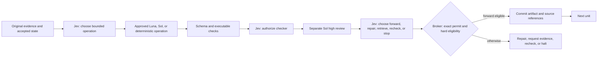

# Jev-Orchestrated Decision Mesh

**Caber Interstitial Decision Mesh (CIDM): a checked, training-free decision graph**

**Architecture and research thesis, 23 September 2026**
**Creator and main contributor:** Kenneth Vic A. Caber

## Abstract

Caber Interstitial Decision Mesh (CIDM) is a software controller around existing inference services. It uses TypeSafe Jev to select typed actions before bounded work and again after a separately invoked, high-effort review of that work. A deterministic broker alone decides whether an artifact becomes accepted context. The five-unit reference path is `input → interpret → compute → reconcile → output`; each unit can halt, repair, request evidence, or seek another check within fixed limits. GPT-6 Luna and Sol at low through xhigh effort are the worker catalog; GPT-6 Sol high is the fixed checker. Astra is excluded unless the user specifically authorizes and configures it.

The research question is whether this interstitial control improves *qualified answer yield per unit of total resources* on a defined task distribution. A single synthetic GPT-6 live integration run completed all five units after two recorded earlier attempts stopped. A matched one-call Sol-high run answered that small task with 85.06× fewer tokens and 7.07× less API cost. This establishes a concrete domain where the five-unit path is inefficient, not a general ranking across projects. A historical 12-task, earlier-version pilot also found fewer Sol tokens but **more total tokens**. This document specifies the control contract and a falsifiable evaluation.

## Position relative to prior work

[FrugalGPT](https://arxiv.org/abs/2305.05176) studies cost-aware LLM cascades, and [RouteLLM](https://arxiv.org/abs/2406.18665) trains routers from preference data. CIDM instead tests a fixed, auditable broker with a typed Jev decision at each observable operation boundary and after each checker return. Jev's vendor describes it as mapping unstructured state to typed probabilistic decisions; that is a suitable interface for selecting among predefined actions, but vendor evaluations of Jev do not measure CIDM end to end. [TypeSafe's Jev announcement](https://typesafe.ai/blog/introducing-system-one-models-and-jev) describes those capabilities and its own evaluation caveats.

The five software units and selective context borrow vocabulary from neural networks and [Transformers](https://arxiv.org/abs/1706.03762). CIDM is not a neural layer, self-attention mechanism, differentiable graph, or trained router. Its policy, limits, permitted models, and hashes are operator-defined and remain fixed for a run. No first-invention claim is made for routing, verification, or model cascades; Kenneth Vic A. Caber's attribution covers this named combination and implementation.

## Topology admission before the checked network

The measured GPT-6 fixture shows that mandatory five-unit checking is a poor default for a small arithmetic task. The general CIDM skill therefore begins with a **typed Jev topology choice** among deterministic computation, one bounded Luna/Sol worker, the five-unit checked graph, evidence retrieval, and stop. [The exact option schema](../examples/topology.request.json) is included. A deterministic or direct-worker answer must be labeled as such and evaluated by its own task validator; it has not passed the five-unit review policy. A user request for the checked network restricts the choice to that graph or a stop. This initial decision is a skill-guided workflow, while the current Python `network_run.py` always executes the checked graph when called.

The admission gate itself consumes Jev input and output. The one-call Sol baseline in this report **did not** include a Jev admission gate, so the comparison quantifies the cost of the strict five-unit graph, not the cost of a future general CIDM topology selector. A proper route-selection experiment must count its Jev call and any mistakes that send easy tasks to the expensive branch.

## Reference transaction

The reference implementation executes the five units in sequence. Input normalization and exact computation can use deterministic code. Interpret, reconcile, and output can use one of eight Jev-approved routes: Luna or Sol × low, medium, high, or xhigh. The checker stays Sol high even when the worker is Luna. A checker *pass* never commits by itself. An invalid checker return is represented as a bounded invalid envelope and sent to Jev; it is ineligible for forwarding. The checker is not recursively checked by another Sol call, so the graph can terminate. The current code bounds candidate repair to two attempts per unit and checking to two attempts per candidate. A request for missing evidence halts the reference runner until an application supplies an actual retrieval adapter.

Jev can choose between predefined alternatives. It does not write the next prose summary. A worker or deterministic function creates the artifact and its source references. Five worker scores on a 1–5 scale—correctness, evidence, completeness, constraints, usefulness—and an optional self-probability are diagnostic metadata, not acceptance criteria or calibrated probabilities.

## State and transition contract

At unit $u_t$, define the broker state as

$$
S_t=(G,E_v,A_t,P_t,\pi_v,B_t,R_t,L_t),
$$

where $G$ is the goal, $E_v$ immutable versioned original evidence, $A_t$ committed artifacts in required order, $P_t$ provisional artifacts and check results, $\pi_v$ a frozen policy/configuration fingerprint, $B_t$ remaining call and financial budgets, $R_t$ attempt counts, and $L_t$ an append-only event journal. The state given to a model is a bounded *view* of $S_t$, not the authority that changes $S_t$. An exact candidate $c$, validator result $h$, checker result $k$, and Jev option $d$ define a transition $T(S_t,c,h,k,d)\rightarrow S_{t+1}$ only if the broker admits it.

The current controller enforces these operational invariants:

1. **Ordered provenance.** Unit $u_t$ runs only after every preceding unit has committed; accepted artifacts and the policy fingerprint are checked for mutation.
2. **Exact dispatch.** A single-use permit binds the operation, unit, attempt, predecessor hashes, selected worker model/effort, and policy version. It cannot be reused for another call.
3. **Separated review.** The checker receives original evidence, the candidate, relevant parent artifacts, and executable check results. Producer self-scores, self-probability, earlier checker opinions, and Jev's preferred outcome are omitted from its review input.
4. **Post-check decision.** Every *completed* checker return, including an invalid one, is followed by a Jev choice before any commit. Transport failure may halt earlier; it never counts as a pass.
5. **Forward eligibility.** `forward` commits only if the candidate schema and all executable checks pass, the exact checker report is valid and says `pass`, Jev selects `forward`, hashes still match, and the matching permit remains valid. Failed or unknown conditions fail closed.
6. **Bounded continuation.** Repair makes a new candidate requiring a new checker and Jev decision; recheck cannot erase earlier reports; exhausted limits halt.

These are safety properties of the *trusted controller under its stated assumptions*, not a proof that the final answer is factually correct. Incorrect original evidence, a mistaken checker, flawed validators, a compromised host callback, or correlated worker/checker errors can still produce a wrong but formally admissible answer. The broker can interpose only between observable calls; it cannot inspect or steer a provider model's hidden reasoning tokens or every thought within a single invocation.

## Context as a referenced view

The context passed to each actor should contain the local objective, constraints, verified facts, source IDs and hashes, relevant accepted predecessors, unresolved questions, and a compact candidate when present. Store original source bytes separately and make them retrievable. Treat a summary as a lossy index to evidence, never as an authoritative replacement. A material claim should resolve to one or more source spans; missing or contradictory spans should trigger `retrieve_evidence` or `stop`.

This is a testable compression policy. It may reduce repeated input tokens, but the checker may need to reopen original material, and its extra call can dominate the budget. Record summary length, source coverage, retrieval count, contradiction rate, and answer quality against a full-context arm. A purported context saving is invalid if it loses necessary evidence or causes more repair/checker calls. Source text remains untrusted data; its instructions are not broker policy.

## Two execution and billing paths

**Implemented API path.** The local skill currently has an OpenRouter transport for Jev and the OpenAI-family worker/checker calls. API credentials and provider bills are separate from a ChatGPT subscription. The exact model/provider identity is checked at runtime; missing usage is recorded as unknown. [OpenAI authentication documentation](https://learn.chatgpt.com/docs/auth) distinguishes ChatGPT sign-in from API-key billing.

**Proposed trusted-host path.** A local adapter could keep Jev on its own API while invoking Luna/Sol workers and the Sol-high checker through authenticated Codex under the user's ChatGPT subscription. [Codex SDK](https://learn.chatgpt.com/docs/codex-sdk) can start local threads, and [`codex exec`](https://learn.chatgpt.com/docs/non-interactive-mode) supports scripted execution, JSONL events with token usage, and a final JSON Schema. [Codex authentication](https://learn.chatgpt.com/docs/auth) permits ChatGPT sign-in for subscription access; an API-key sign-in changes the billing path. The host adapter must verify the effective login, model, effort, sandbox, response schema, usage fields, and failure semantics in a bounded local test. It must create isolated checker context and return control to the CIDM broker after each bounded call. Codex's own internal work is not automatically an atomic CIDM step. This adapter is a design specification here, not an implemented or measured integration.

The host path is for a trusted local session with its normal user permissions and usage limits. Subscription login is not a general-purpose OpenAI API credential, and no browser-cookie or token extraction is implied. OpenAI's non-interactive guidance cautions against moving ChatGPT-managed auth into public repository CI. Availability of GPT-6 models varies by rollout and workspace settings; the [ChatGPT model catalog](https://learn.chatgpt.com/docs/models) and [September 2026 changelog](https://learn.chatgpt.com/docs/changelog) are the relevant product records.

## Complete resource accounting

Let $\mathcal{C}$ be **all attempted** model calls for a request: Jev decisions, workers, five required checkers, repairs, rechecks, and escalations, including failed calls that incurred usage. For each call $j$, let $i_j$, $r_j$, $w_j$, and $o_j$ be mutually exclusive billable categories of ordinary input, cached-read input, cache-write input, and output tokens. Output includes billed reasoning tokens, which must not be added again. With provider/model/processing-specific prices $p_j^i,p_j^r,p_j^w,p_j^o$, the API cost is

$$
C_{\mathrm{API}}=\sum_{j\in\mathcal{C}}\frac{i_jp_j^i+r_jp_j^r+w_jp_j^w+o_jp_j^o}{10^6}
+ C_{\mathrm{tool}}+C_{\mathrm{other\ billed}},
$$

or the sum of authoritative provider-reported charges when available. Jev is already a member of $\mathcal{C}$; adding a separate Jev total to this sum would double count it. If a provider reports cached input as a subset of total input, subtract it from ordinary input first. Processing tiers, regional uplifts, tool fees, long-context multipliers, and missing counters must be represented explicitly. [OpenAI API pricing](https://developers.openai.com/api/docs/pricing) is a rate schedule, not a measurement of CIDM's actual call graph. [Reasoning-token documentation](https://developers.openai.com/api/docs/guides/reasoning) states that hidden reasoning tokens are billed as output.

For a subscription-host run, report **three separate ledgers**: provider-accounted tokens, Codex credits or included-usage consumption for worker/checker calls, and actual external API dollars for Jev and tools. The [ChatGPT/Codex pricing documentation](https://learn.chatgpt.com/docs/pricing) gives GPT-6 credit rates and says included limits depend on plan and current usage; it also distinguishes API-key billing. Credits are not dollars, and an API-equivalent shadow price is not an invoice. Model choice, context, tools, cache behavior, and remaining limits affect the number of tasks a subscription can serve.

The common claim that Luna-first routing pays off once Luna handles more than 5% of tasks assumes equal token footprints, one Luna call replacing one Sol call, no Jev, no checker, no retry, and unchanged quality. CIDM violates several of those assumptions by design. If $C_S$ is a matched Sol-only baseline and $p$ is the fraction that still escalates to Sol, a simplified break-even condition is

$$
C_J+C_L+C_K+C_R+C_T+pC_S<C_S,
$$

where $C_J$ counts every Jev decision, $C_L$ Luna work, $C_K$ mandatory Sol-high checks, $C_R$ repair/recheck work, and $C_T$ tool overhead. In the fixed five-unit reference, $C_K$ alone includes up to five Sol-high checks before retries. A cost or token advantage is therefore an empirical hypothesis, and it must be evaluated at comparable answer quality and release coverage. This equation is a planning decomposition; real costs use per-call measured usage and can vary with the task.

The supplied “$10,000 website” comparison computes `1 − 0.07022 / 0.2035 = 65.49%`. That is a correct ratio of **assumed charges**, not a measured reduction in website delivery cost. It lacks an implemented site, equivalent quality rubric, actual Jev usage, five required checker calls, and tool/revision costs. Its Sol Max and Opus branches are outside this skill's default worker catalog. The proposed 90–95% saving over a hypothetical 1,000-request mix likewise depends on unobserved routing frequencies and comparable output quality. See [the full forecast audit](ROUTING-ECONOMICS.md#audit-of-the-premium-website-forecast). A held-out website benchmark is required before making either claim.

## Evidence status on 23 September 2026

| Claim | Evidence | Interpretation |
| --- | --- | --- |
| Broker enforces the local gate contract | The current skill validation record reports **58 passing offline tests** and a five-unit simulation audit | Controller/transport behavior on synthetic fixtures; no general model-quality estimate |
| GPT-6 API path can complete the reference calculation | One synthetic live run: **5 committed units, 23 calls, 36,663 provider-accounted tokens, $0.012201078 reported cost**; final value 50 defects per 1,000 production items; journal audit passed | One integration observation, with 15 Jev, 5 Sol-high checker, and 3 Luna-low worker calls |
| Single-call Sol-high baseline on that fixture | **1 call, 431 tokens, $0.001726 reported cost**; same final value, scope, trial exclusion, and source checks passed | Checked path cost **7.07×** as much and used **85.06×** as many tokens for this task; see the [recorded evidence](../research/live-gpt6-fixture/README.md) |
| Historical pilot reduced Sol tokens | 12 paired synthetic tasks: Sol tokens **34,942 → 25,030** | True for a prior selection-and-review design, not the current five-unit checker graph |
| Historical pilot saved total tokens | Total provider-accounted tokens **34,942 → 131,388** | Refuted for that pilot; total tokens grew **276.0%** |
| Historical pilot lowered observed API cost | **$0.255236 → $0.230693**, a **9.6%** reduction | Small observed difference; the reported 95% paired interval for savings spans **−29.3% to +49.1%** |
| Historical pilot preserved answer release | Baseline released **12/12**; CIDM released **7/12** | Refuted for that pilot; five answers were withheld |
| Current GPT-6 skill saves resources or improves task yield | One small matched GPT-6 fixture disfavors the five-unit path; no comparison across a task distribution or subscription-host measurement | A general savings claim is unsupported; route admission must exclude simple tasks before a broader trial |

The historical pilot had one run per task, used GPT-5.6 Sol medium and Jev, and did not use Sol-high after each of five units. It counted API execution only. Its value checks were correct for all candidates, while its strict citation/status rubric and abstention policy affected release coverage. The recorded dataset, ledgers, corrected analyzer, and disclosed post-evaluation amendment reproduce its aggregates offline; the exact API outputs are historical observations and cannot be regenerated deterministically. See `BENCHMARKS.md` and the historical pilot appendix for the complete boundary. The pasted cost scenarios in earlier discussion are forecasts with assumed call counts and token volumes; they are not observations, and several omit mandatory checker/Jev work.

## Falsifiable evaluation protocol

1. **Freeze the task sample and policy.** Predefine task strata, source packages, exact model IDs and effort, routing options, checker prompt, attempt limits, acceptance rubric, quality margin, accounting boundary, and analysis code. Hold out evaluation tasks from prompt/policy iteration. Record full configuration hashes and provider identities.
2. **Use matched comparisons.** Run paired, randomized-order repetitions of (a) a capable Sol-only baseline, (b) a five-unit graph with fixed worker routes, (c) the checked graph without Jev post-checker choice where safe to compare, and (d) CIDM with Jev routing and post-checker control. Match source access, tools, time ceilings, and release criteria. Separate API and subscription-host studies because their billing units differ.
3. **Grade blind and preserve abstentions.** Report factual correctness, source support, constraint satisfaction, release coverage, correct releases per input task, invalid releases, and latency distribution. Use deterministic validators where possible and blinded human review for open answers. A rejected correct answer is a coverage loss, not a correctness win.
4. **Account for all work.** Include Jev, workers, mandatory checker calls, failed attempts, repairs, retrieval, orchestration tools, and all reported usage. Mark unknown usage as unknown, not zero. Report total provider tokens, dollar charges, credits, wall-clock time, and p95 latency separately. Include error and refusal rates.
5. **Estimate uncertainty.** Analyze paired task differences by stratum with confidence intervals and a preregistered quality noninferiority rule. Size the study for the intended margin; the 12-task historical pilot does not establish a small quality margin. Repeat stochastic runs, and publish redacted per-task accounting sufficient to reproduce aggregates.
6. **Test compression and routing separately.** Compare source-linked compact views with full-context views under the same model/checker policy. Measure evidence omission and reopen rate. Compare Jev route choices with fixed Luna, fixed Sol, and a post hoc oracle on tasks with known outcomes. Calibrate any claimed Jev probability against held-out labels using proper scoring rules such as Brier score; worker self-probabilities remain uncalibrated unless separately tested.

Primary hypotheses are: (H_1), CIDM has lower total API dollars or fewer Codex credits than a matched baseline at preregistered noninferior qualified answer yield; (H_2), post-checker Jev choice reduces invalid releases enough to justify its incremental Jev/checker cost; and (H_3), source-linked context views reduce total input usage without worsening source-supported answer quality. Any failure of the cost, quality, or coverage condition rejects the corresponding efficiency claim for that task distribution.

## Limits of inference

Five mandatory Sol-high checks can make a short task more expensive than a single strong call. Checker and worker share a model family and may share errors. Typed output and successful schema validation do not validate the option chosen. Source compression can hide decisive evidence; retrieval is not yet part of the reference runner. Provider rates, model access, cache policy, and ChatGPT credit limits can change. Host-native Codex may spend extra tokens on its own agent runtime, and the broker cannot control private reasoning inside a turn. The verified controller properties depend on trusted code, not on Jev's confidence or the worker's five scores. These limitations are measurable failure modes for the protocol above, not qualifications to an already demonstrated efficiency result.
